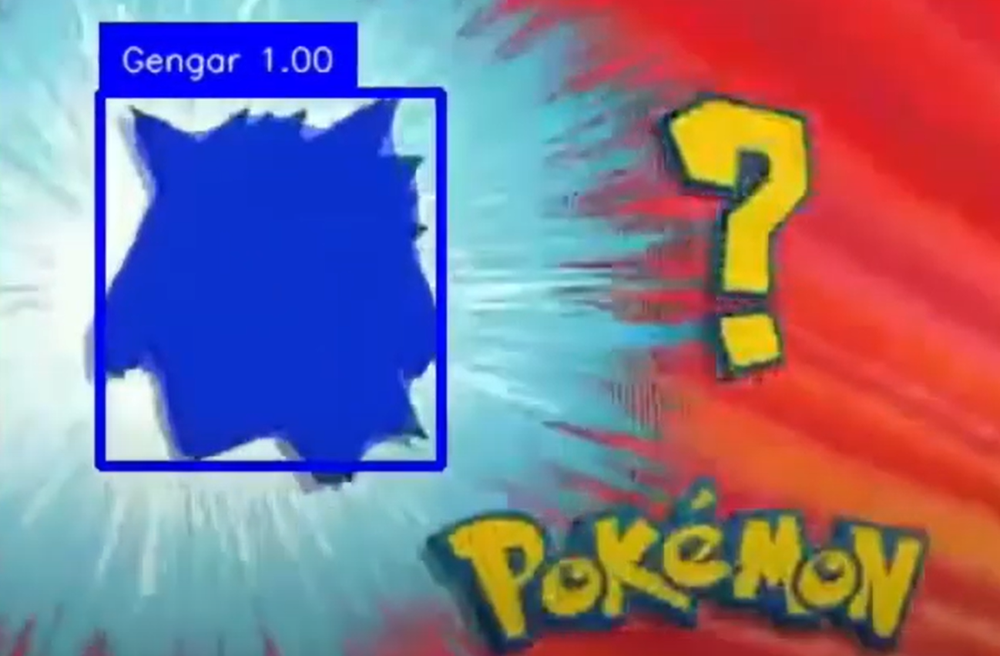

# Who's that Pokemon AI? 

Having trouble identify the masked Pokemon on Television? Fear no more, Pokemon AI is here to help! Our model is so dedicated that it only recognize 1 species of Pokemon - Gengar. Yes, I am too lazy to prepare dataset for the other Pokemons. If you want the model to work for more species, please load the dataset into the train script.

# Video

# Model
*Model trained on top of the Detectron2 MaskRCNN.*

## How to use
To use, first download the Detectron2 repository, and then add this project to the Detectron2 project folder.

**Training:** `pokemon_data_train.ipynb`

**Picture inference:** `whos_that_pokemon_pic.py`

**Video inference:** `whos_that_pokemon_vid.py`,  using roboflow [supervision](https://github.com/roboflow/supervision) library for video processing.

# Takeaways

## The challenge

The "Who's that Pokemon?" game displays only a masked contour of the Pokemon, while our training images primarily are detailed Pokemon photos in color and grayscale. Can our model learn to capture contour information from these training images?

## How many images are needed to train the MaskRCNN model?

Find my dataset on [Roboflow Universe](https://universe.roboflow.com/myworkspace-f4yig/whos_that_pokemon/dataset)

### Datasets
**V1 (27 training images):** Sufficient for identifying Gengar's front standing posture, but ineffective for other poses or side views.

**V2 (37 training images):** Capable of identifying Gengar in various postures thanks to additional training data on its back and side views. However, despite some variation in body color, the model heavily associates Gengar with its original color, leading to poor performance in the "Who's that Pokemon?" game.

**V3 (111 training images):** Best performance. Similar dataset as V2, added few more images, and added rotation and grayscale argumentation to part of the dataset.

### Conclusion

Key factors: dataset diversity, grayscale, rotation. 

## How to evaluate model performace?

### Increase number of epochs does not help much in this model

From 300 to 600 epochs, the total loss decreased from 0.19 to 0.17, but this had little impact on inference results.

### The loss appears sub-optimal, but the mAP scores are excellent

Even with our best performing model, the loss 0.16, which makes me suspect the model hasn't fully converged. 

However, the AP and mAPx results are excellent and likely more reliable for evaluating bounding boxes and masks.

As a general reference, these are the excellent scores for each metric.

| Metrics  | Score   |
| ------------ | ------------ |
| AP  | > 0.6  |
| AP50  | > 0.8  |
| AP75 | > 0.6 |

